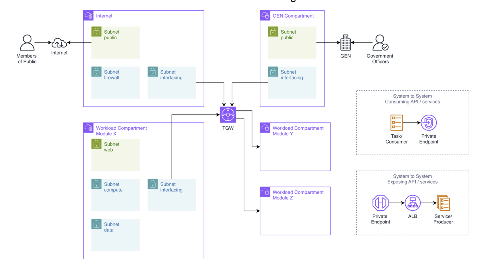

# Homework Infrastructure

Terraform/Terragrunt IaC for a multi-compartment AWS network architecture deployed in `ap-southeast-1`.

## Architecture



The infrastructure is organized into five isolated VPC compartments connected via Transit Gateway (TGW) or AWS PrivateLink depending on the workload type.

### VPC Compartments

| Compartment  | CIDR           | Subnet Layers                              | Connectivity |
|--------------|----------------|--------------------------------------------|--------------|
| Internet     | `10.0.0.0/16`  | public / firewall / interfacing            | IGW, NAT GW, NFW, TGW |
| GEN          | `10.1.0.0/16`  | public / interfacing                       | IGW, TGW     |
| Workload X   | `10.2.0.0/16`  | web / compute / data / interfacing         | TGW          |
| Workload Y   | `10.3.0.0/16`  | private                                    | PrivateLink (consumer) |
| Workload Z   | `10.4.0.0/16`  | private                                    | PrivateLink (producer) |

### Connectivity Patterns

- **Ingress (Internet → Workload X)**: Public ALB in Internet VPC → proxy ASG in interfacing subnet → TGW → Workload X internal ALB → backend ASG.
- **Egress (Workload X → Internet)**: Routes through TGW to the Internet compartment, through NFW for inspection, then out via NAT Gateway → IGW.
- **Ingress (Internet → GEN)**: Directly via IGW to GEN public subnet.
- **Egress (GEN → Internet)**: Routes directly via IGW (used by government officers).
- **Workload Y → Workload Z**: Exclusively through AWS PrivateLink (VPC Endpoint Interface → Endpoint Service). There are **no TGW attachments** on Workload Y or Z.

### Traffic Flow (Workload Y → Workload Z)

```
Workload Y consumer app
  └─> endpoint-interface (VPC Endpoint)
        └─> endpoint-service (NLB)
              └─> internal ALB (workload-z/load-balance)
                    └─> backend ASG (services/workload-z/backend)
```

### TGW Route Design

The TGW uses a single default route table with a default egress route pointing to the Internet VPC attachment. Per-compartment TGW routes are defined in `constants.hcl`:

| Compartment  | TGW routes learned (CIDRs reachable via TGW) |
|--------------|----------------------------------------------|
| Internet     | `10.2.0.0/16` (Workload X) |
| GEN          | `10.2.0.0/16` (Workload X) |
| Workload X   | `10.0.0.0/16` (Internet), `10.1.0.0/16` (GEN) |
| Workload Y   | — (no TGW attachment) |
| Workload Z   | — (no TGW attachment) |

---

## Repository Structure

```
.
├── infrastructure/
│   ├── constants.hcl              # Global constants (CIDRs, TGW routes, project name, region)
│   ├── terragrunt.hcl             # Root config: remote state, provider generation, common tags
│   └── dev/
│       ├── env.hcl                # Environment identifier (environment = "dev")
│       ├── network/
│       │   ├── shared/            # Transit Gateway (shared across compartments)
│       │   ├── internet/          # IGW, NAT GW, NFW, subnets, route tables, TGW attachment, ALB
│       │   ├── gen/               # GEN VPC, subnets, route tables, IGW, TGW attachment
│       │   ├── workload-x/        # Workload X VPC, subnets, route tables, TGW attachment, ALB
│       │   ├── workload-y/        # Workload Y VPC, private subnets, endpoint-interface
│       │   └── workload-z/        # Workload Z VPC, private subnets, endpoint-service, ALB
│       └── services/
│           ├── internet/proxy/    # Nginx proxy ASG in internet interfacing subnet
│           ├── workload-x/backend # Python HTTP server ASG in workload-x compute subnet
│           └── workload-z/backend # Python HTTP server ASG in workload-z private subnet
├── modules/
│   ├── unit/                      # 16 atomic Terraform modules (one AWS resource type each)
│   └── components/                # 4 composed modules built from unit modules
└── scripts/
    ├── assume-role                # IAM role assumption helper
    ├── format                     # HCL + Terraform formatter
    └── terraform-code-scan        # Checkov security scanner
```

### Module Hierarchy

```
modules/unit/          Atomic building blocks (one AWS resource type each)
      │
      ▼
modules/components/    Composed modules (combine multiple unit modules)
      │
      ▼
infrastructure/        Terragrunt configs that instantiate component modules
```

**Unit modules** (16): `autoscaling-group`, `endpoint-interface`, `endpoint-service`, `internet-gateway`, `listener`, `load-balance`, `nat-gateway`, `network-firewall`, `route-table`, `security-group`, `subnet`, `target-group`, `transit-gateway`, `transit-gateway-attachment`, `transit-gateway-route`, `vpc`

**Component modules** (4): `alb` (ALB + security group + target group + listener), `asg-service` (ASG + launch template + security group), `endpoint-service` (NLB + endpoint service), `transit-gateway-attachment` (TGW attachment + route)

### Compartment Configuration Pattern

Each network compartment directory contains a `compartment.hcl` file that declares `compartment` and `network` locals. These are consumed by child Terragrunt configs to look up CIDR and route data from `constants.hcl` without hardcoding values.

---

## Prerequisites

| Tool        | Version     |
|-------------|-------------|
| Terraform   | >= 1.6.0    |
| Terragrunt  | latest      |
| AWS CLI     | v2          |
| Checkov     | latest (for security scanning) |

---

## Getting Started

### 1. Configure AWS Credentials

Assume an IAM role with sufficient permissions:

```bash
eval "$(./scripts/assume-role arn:aws:iam::<account-id>:role/<role-name> dev-session)"
```

Or use any standard AWS credential method (`~/.aws/credentials`, environment variables, instance profile).

### 2. Bootstrap Remote State

The root `terragrunt.hcl` expects an S3 bucket and DynamoDB table to exist before first use:

| Resource       | Name pattern                                      |
|----------------|---------------------------------------------------|
| S3 bucket      | `homework-dev-tfstate-ap-southeast-1`             |
| DynamoDB table | `homework-dev-tflock`                             |

Create them once:

```bash
aws s3api create-bucket \
  --bucket homework-dev-tfstate-ap-southeast-1 \
  --region ap-southeast-1 \
  --create-bucket-configuration LocationConstraint=ap-southeast-1

aws s3api put-bucket-versioning \
  --bucket homework-dev-tfstate-ap-southeast-1 \
  --versioning-configuration Status=Enabled

aws s3api put-bucket-encryption \
  --bucket homework-dev-tfstate-ap-southeast-1 \
  --server-side-encryption-configuration '{"Rules":[{"ApplyServerSideEncryptionByDefault":{"SSEAlgorithm":"AES256"}}]}'

aws dynamodb create-table \
  --table-name homework-dev-tflock \
  --attribute-definitions AttributeName=LockID,AttributeType=S \
  --key-schema AttributeName=LockID,KeyType=HASH \
  --billing-mode PAY_PER_REQUEST \
  --region ap-southeast-1
```

### 3. Deploy

Terragrunt `run-all` deploys the entire environment in dependency order:

```bash
# Plan everything
cd infrastructure/dev
terragrunt run-all plan

# Apply everything
terragrunt run-all apply
```

To operate on a single module:

```bash
cd infrastructure/dev/network/shared/transit-gateway
terragrunt plan
terragrunt apply
```

### Recommended Deployment Order

1. `network/shared/transit-gateway`
2. All VPCs (`internet/vpc`, `gen/vpc`, `workload-x/vpc`, `workload-y/vpc`, `workload-z/vpc`)
3. Subnets and route tables
4. Gateways (IGW × 2, NAT GW, NFW)
5. TGW attachments and routes (`internet`, `gen`, `workload-x`) + `internet/tgw-route-default-egress`
6. PrivateLink resources (`workload-z/endpoint-service`, `workload-y/endpoint-interface`)
7. Load balancers and service backends

Terragrunt respects `dependency` blocks and handles ordering automatically with `run-all`.

---

## Scripts

### `scripts/assume-role`

Assumes an IAM role and exports temporary credentials as environment variables.

```bash
eval "$(./scripts/assume-role <role-arn> <session-name>)"
```

Credentials are valid for 1 hour.

### `scripts/format`

Formats all HCL and Terraform files in the repository.

```bash
./scripts/format
```

Runs `terragrunt hclfmt` over `infrastructure/` and `terraform fmt -recursive` over `modules/`.

## Configuration Reference

Global configuration lives in `infrastructure/constants.hcl` and is available to all Terragrunt modules via `include.root.locals`.

| Key                                        | Value                                              |
|--------------------------------------------|----------------------------------------------------|
| `project`                                  | `homework`                                         |
| `aws_region`                               | `ap-southeast-1`                                   |
| `environment` (dev)                        | `dev`                                              |
| `max_az_count`                             | `3`                                                |
| `networks.dev.workload_cidrs`              | `["10.2.0.0/16","10.3.0.0/16","10.4.0.0/16"]`     |
| `networks.dev.tgw_routes.internet`         | `["10.1.0.0/16","10.2.0.0/16"]`                   |
| `networks.dev.tgw_routes.gen`              | `["10.2.0.0/16"]`                                  |
| `networks.dev.tgw_routes.workload_x`       | `["10.0.0.0/16","10.1.0.0/16"]`                   |
| `networks.dev.workload_x_compute_allowed_cidrs` | `[]` (configurable allowlist for compute subnet TGW routes) |

All resources are automatically tagged with `Project`, `Environment`, and `ManagedBy = "Terragrunt"` via the AWS provider's `default_tags` (merged in the root `terragrunt.hcl`).

---

## Question

### Given three possible security flaws with the design and how you can exploit them?
- Ingress lacks WAF or L7 protections → currently the NFW is only working for the egress traffic, public entry points are exposed to common web attacks eaving it exposed to attacks such as SQL injection and XSS.
- Workload X data subnet isolation is too weak → data subnets should have no TGW routes and should only allow inbound from the compute subnet’s security group. If those controls are missing, a compromised web/compute tier can directly reach sensitive data.
- No east-west inspection between TGW-connected VPCs → TGW routes allow GEN ↔ Workload X traffic without any inline inspection (NFW only covers egress). A compromise in one VPC can laterally move to the other without detection or policy enforcement.

### Discuss three (3) trade-off for the design

1. Traffic design: Public ALB → ASG proxy (Internet VPC) → Private ALB (Workload X).
- This keeps Workload X private while still enabling WAF/L7 controls on the public edge, and it supports future autoscaling inside the Workload VPC (ALB + ASG/ECS/EKS). But there is an extra hop, higher operational complexity, and additional cost for the proxy tier.
- Alternative 1: Internet-facing NLB → Private internal ALB. This simplifies L4 ingress and can reduce latency, and Workload autoscaling still works (internal ALB + ASG/ECS/EKS). The downside is no WAF/L7 protections at the edge (NLB limitation), weaker application-layer visibility, and ALB → ALB chaining is not supported, so you cannot add L7 controls before the internal ALB.
- Alternative 2: Expose the private internal ALB directly to the public. This shortens the path and reduces components, and Workload autoscaling still works. The downside is it breaks private VPC isolation, expands the attack surface, and weakens the security boundary by placing workload entry points directly on the internet.

2. Subnet security: Strict subnet-to-subnet and TGW allowlists (security-first design).
- Web can only reach compute, compute can reach web + data, data cannot reach other VPCs, and TGW routes are tightly scoped. This sharply reduces lateral movement and protects the data plane, but increases operational complexity, makes troubleshooting harder, and reduces flexibility for new cross-subnet or cross-VPC dependencies.
- Alternative: Flat subnets within the VPC — all subnets share the same route table and security groups are the sole control. This simplifies routing and speeds up development, but a single misconfigured security group rule allows any instance to reach any other in the VPC, including the data plane.

3. Internal ALB in Workload X as the single ingress entry point.
- A private internal ALB sits in the Workload X web subnet and receives all inbound traffic from the Internet VPC proxy. This means workload services (backend ASG in the compute subnet) are never directly exposed to the internet or to cross-VPC callers — everything enters through the ALB. The ALB also enables horizontal autoscaling: as compute instances scale in or out, the ALB automatically distributes traffic across them without any DNS or routing changes.

